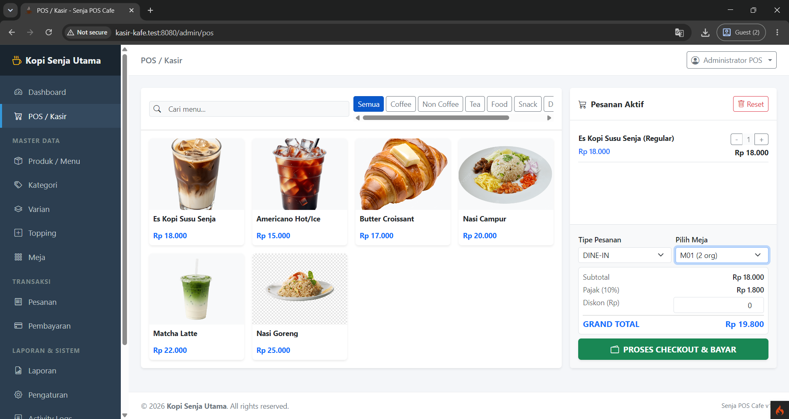
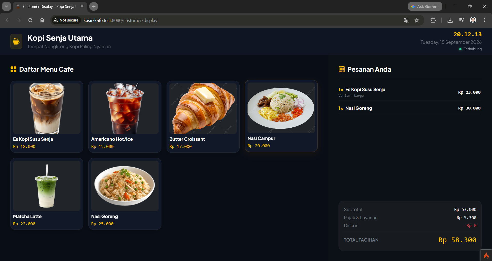
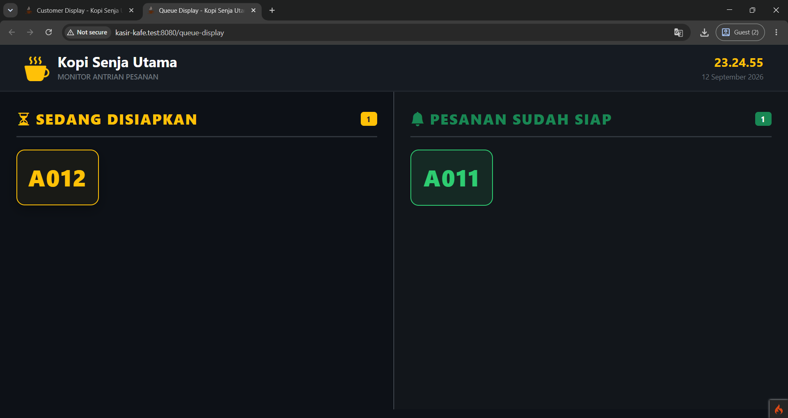

# CAFE-POS-SYSTEM

<p align="center">
  <strong>Point of Sale & Cafe Management System</strong>
</p>

<p align="center">
  A web-based Point of Sale and cafe management application built with CodeIgniter 4.
</p>

<p align="center">
  <a href="https://github.com/yolanchndr/CAFE-POS-SYSTEM">
    
  </a>
  
  
  
</p>

<p align="center">
  
  
  
  
</p>

<p align="center">
  
  
  
  
</p>

## Preview

### Point of Sale



### Customer Display



### Antrian Display



---

## Tentang Project

**CAFE-POS-SYSTEM** adalah aplikasi **Point of Sale (POS) dan manajemen operasional kafe** berbasis web yang dibangun menggunakan **PHP, CodeIgniter 4, dan MySQL**.

Aplikasi ini dirancang untuk membantu operasional kafe atau restoran dalam mengelola menu, transaksi penjualan, meja, pesanan, pembayaran, customer display, order display, hingga pengaturan sistem.

Sistem menggunakan pendekatan **MVC (Model-View-Controller)** CodeIgniter 4 serta pemisahan logic menggunakan Model, Controller, Service, Filter, Helper, Migration, dan Seeder.

Project ini dibuat dengan fokus pada:

- Struktur aplikasi yang terorganisir.
- Pengelolaan data berbasis database.
- Proses transaksi yang terstruktur.
- Pengelolaan menu secara dinamis.
- Dukungan operasional DINE-IN dan TAKEAWAY.
- Monitoring status pesanan.
- Pengelolaan pembayaran.
- Activity logging.
- Konfigurasi sistem melalui database.

---

# Fitur Utama

## 1. Point of Sale (POS / Kasir)

Modul POS digunakan untuk membuat dan mengelola transaksi penjualan.

Fitur:

- Katalog produk berdasarkan kategori.
- Pencarian produk.
- Pemilihan produk.
- Pemilihan varian.
- Pemilihan topping.
- Catatan khusus per item.
- Perhitungan subtotal otomatis.
- Perhitungan pajak.
- Perhitungan service charge.
- Diskon.
- DINE-IN.
- TAKEAWAY.
- Pemilihan meja untuk DINE-IN.
- Ringkasan pesanan sebelum pembayaran.

Contoh alur:

```text
Pilih Produk
     ↓
Pilih Varian
     ↓
Pilih Topping
     ↓
Tambahkan Catatan
     ↓
Pilih Tipe Pesanan
     ↓
Pilih Meja
     ↓
Review Pesanan
     ↓
Pembayaran
```

---

## 2. Kategori Menu

Administrator dapat mengelola kategori menu secara dinamis.

Fitur:

- Tambah kategori.
- Edit kategori.
- Hapus kategori.
- Status kategori.
- Urutan kategori.
- Pengelompokan produk berdasarkan kategori.

---

## 3. Produk / Menu

Administrator dapat mengelola seluruh menu yang tersedia pada sistem.

Data produk meliputi:

- Nama produk.
- Harga dasar.
- Deskripsi.
- Gambar.
- Kategori.
- Status ketersediaan.
- Varian.
- Topping.

Status produk dapat digunakan untuk menandai menu:

```text
Tersedia
Habis
```

---

## 4. Varian Produk

Satu produk dapat memiliki beberapa varian.

Contoh:

```text
Kopi

├── Regular
└── Large
```

Setiap varian dapat memiliki penyesuaian harga.

Contoh:

```text
Regular  → Harga dasar
Large    → Harga dasar + tambahan
```

---

## 5. Topping

Sistem mendukung tambahan topping pada produk.

Administrator dapat mengatur:

- Nama topping.
- Harga topping.
- Status topping.
- Produk yang memiliki topping tersebut.

Contoh:

```text
Produk:
Iced Coffee

Topping:
├── Extra Shot
├── Cheese
├── Caramel
└── Chocolate
```

---

## 6. Manajemen Meja

Administrator dapat mengelola meja kafe.

Data meja meliputi:

- Nomor meja.
- Kapasitas.
- Status meja.

Status meja:

```text
Available
Occupied
Reserved
Inactive
```

Pada transaksi DINE-IN, kasir dapat memilih meja yang digunakan pelanggan.

Status meja dapat diperbarui berdasarkan kondisi pesanan.

---

# 7. Manajemen Status Pesanan

Sistem memiliki alur status pesanan:

```text
Pending
   ↓
Diproses
   ↓
Siap
   ↓
Selesai
```

Pesanan juga dapat dibatalkan:

```text
Pending
   ↓
Dibatalkan
```

atau:

```text
Diproses
   ↓
Dibatalkan
```

atau:

```text
Siap
   ↓
Dibatalkan
```

Ketika pesanan selesai atau dibatalkan, meja yang digunakan dapat dikembalikan ke status:

```text
Available
```

---

# 8. Kitchen / Order Display

Sistem mendukung display untuk membantu proses pemantauan pesanan.

Display dapat digunakan untuk menampilkan:

- Nomor pesanan.
- Detail pesanan.
- Status pesanan.
- Pesanan yang sedang diproses.
- Pesanan yang siap.
- Pesanan yang selesai.

Perubahan status pesanan dapat digunakan untuk memperbarui informasi pada display secara real-time.

---

# 9. Customer Display

Sistem mendukung penggunaan **Customer Display** pada monitor kedua.

Customer Display berfungsi untuk menampilkan informasi transaksi kepada pelanggan.

Informasi yang dapat ditampilkan:

- Produk.
- Varian.
- Topping.
- Jumlah.
- Harga.
- Subtotal.
- Pajak.
- Service charge.
- Diskon.
- Total pembayaran.

Customer Display hanya berfungsi sebagai **layar informasi**.

Input pesanan tetap dilakukan oleh kasir melalui POS.

---

# 10. Pembayaran

Sistem mendukung pembayaran tunai dan non-tunai.

## CASH

Pembayaran tunai mendukung:

- Input nominal pembayaran.
- Tombol nominal cepat.
- Kalkulasi total.
- Kalkulasi kembalian otomatis.

Contoh:

```text
Total      : Rp35.000
Pembayaran : Rp50.000
Kembalian  : Rp15.000
```

## NON-CASH

Sistem dapat mencatat transaksi non-tunai dengan beberapa metode seperti:

- QRIS.
- GoPay.
- OVO.
- DANA.
- ShopeePay.
- EDC BCA.
- EDC Mandiri.
- Transfer Bank.

> Metode NON-CASH digunakan sebagai pencatatan metode pembayaran pada transaksi. Integrasi langsung dengan payment gateway memerlukan konfigurasi dan layanan tambahan.

---

# 11. Cetak Struk

Sistem mendukung pencetakan struk untuk printer thermal.

Ukuran yang ditargetkan:

```text
58mm Thermal Printer
```

Struk dapat menampilkan:

- Nama kafe.
- Logo.
- Alamat.
- Nomor transaksi.
- Tanggal.
- Waktu.
- Kasir.
- Detail produk.
- Varian.
- Topping.
- Subtotal.
- Pajak.
- Service charge.
- Diskon.
- Total.
- Pembayaran.
- Kembalian.

Contoh:

```text
================================
          CAFE POS
================================
No : INV-20260912-0001
Kasir : Admin
--------------------------------
Iced Coffee
  Large              Rp25.000
  Extra Shot          Rp5.000
--------------------------------
Subtotal             Rp30.000
Tax                   Rp3.000
Service               Rp2.000
--------------------------------
TOTAL                Rp35.000
CASH                 Rp50.000
CHANGE               Rp15.000
================================
        TERIMA KASIH
================================
```

---

# 12. Dashboard

Dashboard digunakan untuk memberikan ringkasan kondisi sistem.

Informasi yang dapat ditampilkan antara lain:

- Total transaksi.
- Penjualan.
- Pesanan.
- Status pesanan.
- Informasi operasional.
- Aktivitas sistem.

Dashboard dapat menjadi pusat monitoring bagi administrator.

---

# 13. Riwayat Transaksi

Sistem menyediakan riwayat transaksi yang dapat digunakan untuk melihat transaksi sebelumnya.

Informasi transaksi dapat mencakup:

- Nomor transaksi.
- Tanggal.
- Waktu.
- Kasir.
- Tipe pesanan.
- Meja.
- Item pesanan.
- Total.
- Metode pembayaran.
- Status transaksi.

---

# 14. Activity Log

Sistem memiliki **Activity Log** untuk mencatat aktivitas penting pengguna.

Contoh aktivitas:

```text
Tambah Produk
Edit Produk
Hapus Produk
Tambah Kategori
Edit Kategori
Hapus Kategori
Transaksi Penjualan
Perubahan Status Pesanan
Perubahan Status Meja
Update Pengaturan
```

Activity Log dapat membantu proses monitoring dan audit aktivitas aplikasi.

---

# 15. Pengaturan Sistem

Informasi kafe dapat dikelola melalui menu pengaturan.

Konfigurasi yang dapat disesuaikan antara lain:

- Nama kafe.
- Informasi kafe.
- Logo.
- Favicon.
- Pajak.
- Service charge.
- Konfigurasi sistem lainnya.

Konfigurasi disimpan pada database sehingga administrator dapat mengubah informasi tanpa melakukan perubahan langsung pada source code.

---

# Alur Sistem

Secara umum alur aplikasi:

```text
                    ┌───────────────┐
                    │   Dashboard   │
                    └───────┬───────┘
                            │
             ┌──────────────┼──────────────┐
             │              │              │
             ▼              ▼              ▼
        Master Data       POS         Pengaturan
             │              │
             │              ▼
             │          Pesanan
             │              │
             │              ▼
             │        Pembayaran
             │              │
             │              ▼
             │        Cetak Struk
             │              │
             │              ▼
             │       Status Pesanan
             │              │
             │       ┌──────┴──────┐
             │       ▼             ▼
             │   Kitchen        Customer
             │   Display         Display
             │
             ▼
        Database MySQL
```

---

# Arsitektur Aplikasi

Project menggunakan arsitektur **MVC** CodeIgniter 4 dengan beberapa komponen pendukung.

```text
                    Browser
                       │
                       ▼
                    Routes
                       │
                       ▼
                  Controller
                       │
          ┌────────────┼────────────┐
          │            │            │
          ▼            ▼            ▼
        Model       Service       Filter
          │            │            │
          └──────┬─────┘            │
                 ▼                  │
              Database             │
                 │                  │
                 └──────────┬───────┘
                            ▼
                          View
                            │
                            ▼
                         Browser
```

Komponen utama:

```text
app/
├── Config/
├── Controllers/
├── Database/
├── Filters/
├── Helpers/
├── Models/
├── Services/
└── Views/
```

---

# Teknologi

| Teknologi        | Penggunaan            |
| ---------------- | --------------------- |
| PHP 8.2+         | Backend               |
| CodeIgniter 4.7+ | Framework             |
| MySQL / MariaDB  | Database              |
| Bootstrap 5      | UI Framework          |
| JavaScript       | Frontend Interaction  |
| HTML5            | Struktur halaman      |
| CSS3             | Styling               |
| Composer         | Dependency Management |
| PHPUnit 10.5+    | Testing               |
| Git              | Version Control       |
| GitHub           | Repository            |

---

# Technology Stack

<p align="center">
  
  
  
  
</p>

<p align="center">
  
  
  
  
</p>

<p align="center">
  
  
  
  
</p>

---

# Struktur Project

```text
CAFE-POS-SYSTEM/
│
├── app/
│   ├── Config/
│   ├── Controllers/
│   │   └── Admin/
│   ├── Database/
│   │   ├── Migrations/
│   │   └── Seeds/
│   ├── Filters/
│   ├── Helpers/
│   ├── Models/
│   ├── Services/
│   └── Views/
│       └── admin/
│
├── public/
│   ├── assets/
│   ├── uploads/
│   └── index.php
│
├── tests/
│   ├── _support/
│   └── unit/
│
├── writable/
│
├── composer.json
├── composer.lock
├── env
├── phpunit.dist.xml
├── preload.php
├── spark
├── LICENSE
└── README.md
```

---

# Requirements

Sebelum menjalankan aplikasi, pastikan environment telah memenuhi kebutuhan berikut:

### Server

- PHP 8.2 atau lebih baru.
- Composer.
- MySQL atau MariaDB.
- Apache atau Nginx.
- PHP Built-in Server untuk development.

### PHP Extensions

Pastikan extension berikut aktif:

```text
intl
mbstring
mysqli
mysqlnd
json
curl
xml
openssl
```

Untuk CodeIgniter 4, extension yang digunakan dapat berbeda tergantung fitur aplikasi dan environment.

---

# Instalasi

## 1. Clone Repository

```bash
git clone https://github.com/yolanchndr/CAFE-POS-SYSTEM.git
```

Masuk ke folder:

```bash
cd CAFE-POS-SYSTEM
```

---

## 2. Install Dependencies

Jalankan:

```bash
composer install
```

---

## 3. Buat File `.env`

### Git Bash

```bash
cp env .env
```

### PowerShell

```powershell
Copy-Item env .env
```

---

# 4. Konfigurasi `.env`

Buka:

```text
.env
```

Kemudian sesuaikan:

```ini
CI_ENVIRONMENT = development

app.baseURL = 'http://localhost:8080/'

database.default.hostname = localhost
database.default.database = cafe_pos
database.default.username = root
database.default.password =
database.default.DBDriver = MySQLi
database.default.port = 3306
```

Jika menggunakan Laragon dengan konfigurasi default, biasanya username MySQL adalah:

```text
root
```

dan password dapat kosong jika memang environment lokal Anda menggunakan konfigurasi tersebut.

---

# 5. Buat Database

Buat database:

```sql
CREATE DATABASE cafe_pos;
```

Atau:

```sql
CREATE DATABASE IF NOT EXISTS cafe_pos;
```

Kemudian pastikan konfigurasi `.env` sesuai:

```ini
database.default.database = cafe_pos
```

---

# 6. Jalankan Migration

Jika migration tersedia:

```bash
php spark migrate
```

Untuk melihat status migration:

```bash
php spark migrate:status
```

Jika project memiliki seeder:

```bash
php spark db:seed DatabaseSeeder
```

---

# 7. Jalankan Aplikasi

Gunakan server bawaan CodeIgniter:

```bash
php spark serve
```

Kemudian buka:

```text
http://localhost:8080
```

---

# Development dengan Laragon

Jika menggunakan Laragon:

```text
C:\laragon\www\CAFE-POS-SYSTEM
```

Pastikan project berada di dalam folder:

```text
C:\laragon\www
```

Kemudian jalankan:

```bash
composer install
```

dan:

```bash
php spark serve
```

Atau gunakan konfigurasi virtual host Laragon dengan document root:

```text
CAFE-POS-SYSTEM/public
```

---

# Production Deployment

Untuk production, **document root wajib diarahkan ke folder `public/`**.

Struktur:

```text
CAFE-POS-SYSTEM/
│
├── app/
├── public/       ← DOCUMENT ROOT
├── tests/
├── writable/
├── system/
├── composer.json
└── ...
```

Contoh:

```text
BENAR
/var/www/cafe-pos-system/public
```

Bukan:

```text
SALAH
/var/www/cafe-pos-system
```

Dengan cara ini, folder internal aplikasi seperti:

```text
app/
writable/
system/
```

tidak menjadi bagian dari direktori yang dapat diakses langsung oleh browser.

---

# Apache

Contoh konsep VirtualHost:

```apache
<VirtualHost *:80>

    ServerName cafe-pos.local

    DocumentRoot /var/www/CAFE-POS-SYSTEM/public

    <Directory /var/www/CAFE-POS-SYSTEM/public>
        AllowOverride All
        Require all granted
    </Directory>

</VirtualHost>
```

Sesuaikan path dengan server Anda.

---

# Nginx

Contoh konfigurasi:

```nginx
server {

    listen 80;

    server_name cafe-pos.local;

    root /var/www/CAFE-POS-SYSTEM/public;

    index index.php index.html;

    location / {
        try_files $uri $uri/ /index.php?$query_string;
    }

    location ~ \.php$ {
        include snippets/fastcgi-php.conf;
        fastcgi_pass unix:/run/php/php8.2-fpm.sock;
    }

}
```

Sesuaikan socket PHP-FPM dengan versi PHP yang digunakan pada server.

---

# Writable Directory

CodeIgniter membutuhkan folder `writable` untuk menyimpan file runtime.

Contoh:

```text
writable/
├── cache/
├── debugbar/
├── logs/
├── session/
└── uploads/
```

Pastikan web server memiliki permission yang sesuai.

Pada Linux:

```bash
chmod -R 775 writable
```

Jika masih mengalami masalah permission, sesuaikan ownership dengan user web server.

---

# Testing

Project menggunakan PHPUnit.

Konfigurasi dependency pada repository menggunakan PHPUnit `^10.5.16`.

Jalankan:

```bash
composer test
```

atau:

```bash
vendor/bin/phpunit
```

---

# Useful CodeIgniter Commands

Melihat semua command:

```bash
php spark
```

Menjalankan development server:

```bash
php spark serve
```

Migration:

```bash
php spark migrate
```

Rollback migration:

```bash
php spark migrate:rollback
```

Melihat migration:

```bash
php spark migrate:status
```

Seeder:

```bash
php spark db:seed NamaSeeder
```

Membersihkan cache:

```bash
php spark cache:clear
```

---

# Security

Sebelum deployment ke production, perhatikan beberapa hal berikut:

- Jangan commit `.env`.
- Gunakan environment `production`.
- Jangan menyimpan password database di repository.
- Gunakan password database yang aman.
- Gunakan HTTPS.
- Arahkan document root ke `public/`.
- Pastikan folder `writable` tidak dapat diakses langsung.
- Validasi input pengguna.
- Gunakan CSRF protection.
- Batasi akses berdasarkan role dan permission.
- Jangan menampilkan error detail pada production.
- Periksa permission file dan folder pada server.

Untuk production:

```ini
CI_ENVIRONMENT = production
```

---

# Roadmap

Pengembangan yang dapat ditambahkan pada versi berikutnya:

- [ ] Payment gateway integration.
- [ ] QRIS payment gateway.
- [ ] Manajemen stok bahan baku.
- [ ] Recipe / bahan produk.
- [ ] Purchase management.
- [ ] Supplier management.
- [ ] Laporan penjualan harian.
- [ ] Laporan penjualan bulanan.
- [ ] Export laporan PDF.
- [ ] Export laporan Excel.
- [ ] Manajemen shift kasir.
- [ ] Multi-role permission.
- [ ] Multi-outlet / multi-cabang.
- [ ] Kitchen Display System yang lebih lengkap.
- [ ] Customer Display yang lebih interaktif.
- [ ] Notifikasi real-time yang lebih fleksibel.
- [ ] Integrasi printer thermal secara langsung.
- [ ] Dashboard analitik yang lebih lengkap.

---

# Contributing

Kontribusi untuk pengembangan project dipersilakan.

Clone repository:

```bash
git clone https://github.com/yolanchndr/CAFE-POS-SYSTEM.git
```

Buat branch:

```bash
git checkout -b feature/nama-fitur
```

Lakukan perubahan kemudian:

```bash
git add .
```

Commit:

```bash
git commit -m "Add nama fitur"
```

Push:

```bash
git push origin feature/nama-fitur
```

Kemudian buat Pull Request.

---

# License

Project ini menggunakan:

**MIT License**

Lihat file:

```text
LICENSE
```

untuk informasi lengkap mengenai lisensi.

---

# Author

**YOLANDIKA SILA CHANDRA**

PHP Developer dengan fokus pada pengembangan aplikasi web menggunakan:

- PHP
- CodeIgniter 4
- Laravel
- MySQL
- JavaScript
- Bootstrap

GitHub:

[github.com/yolanchndr](https://github.com/yolanchndr)

---

# Project Repository

<p align="center">
  <a href="https://github.com/yolanchndr/CAFE-POS-SYSTEM">
    
  </a>
</p>

<p align="center">
  <strong>CAFE-POS-SYSTEM</strong><br>
  Point of Sale & Cafe Management System
</p>

<p align="center">
  Built with PHP & CodeIgniter 4
</p>
